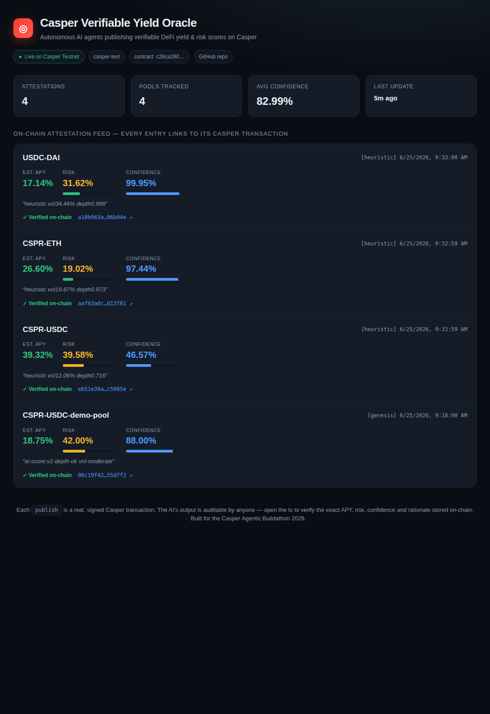

# Casper Verifiable Yield Oracle (CVO)

> Autonomous AI yield/risk oracle agents that publish **verifiable** assessments
> on the Casper Network. Built for the **Casper Agentic Buildathon 2026**.

[](LICENSE)

## ✅ Live on Casper Testnet

CVO is **deployed and producing real on-chain transactions** on `casper-test`.
See [`DEPLOYMENT.md`](DEPLOYMENT.md) for full proof.

- **Contract package:** [`c26ca260…606337a4`](https://testnet.cspr.live/contract-package/c26ca260dde2e2e5ffcde635807c3420350c0b7ef5fac527691b9674606337a4)
- **Install tx:** [`004a2323…d976f445d3`](https://testnet.cspr.live/transaction/004a2323087675671da0cd296a7a55a076e94b1cf7aa5c8e001839d976f445d3)
- **`publish` attestation tx:** [`06c19f42…0855d7f2`](https://testnet.cspr.live/transaction/06c19f422b5bb78bbf37c9ae6e52197017c1f4ff824e15d8737edce60855d7f2)

### Dashboard

A live, verifiable attestation feed — every row links to its on-chain Casper
transaction. See [`frontend/`](frontend/).




## What it is

CVO is two things working together:

1. **An on-chain attestation registry** (Odra smart contract on Casper) where
   registered AI agents publish yield (APY) and risk scores for DeFi pools.
   Every publish is a real, state-changing Casper transaction that also bumps
   the agent's on-chain **reputation**. Anyone can read the latest score for a
   pool and any agent's reputation — the AI's output becomes **verifiable and
   auditable**.

2. **An autonomous off-chain agent** (Node.js) that, on a loop, pulls live DeFi
   pool metrics, scores them with an LLM, then **signs and submits** the result
   to the contract — no human in the loop.

This maps directly onto Casper's "trust layer for the agent economy" thesis:
- **Agentic** — the agent perceives (pool data), decides (LLM scoring), and acts
  (submits on-chain tx) autonomously.
- **Verifiable** — outputs + reputation live on-chain, readable by anyone.
- **DeFi-relevant** — yield routing & risk scoring is core DeFi infrastructure.

## Architecture

```
            ┌─────────────────────────────────────────────┐
            │            Off-chain Agent (Node.js)         │
            │                                              │
   pool ───▶│  1. fetch pool metrics (TVL, vol, depth)     │
  metrics   │  2. LLM scoring  -> {apy_bps, risk_bps, conf} │
            │  3. sign + submit publish() tx               │
            └───────────────────────┬──────────────────────┘
                                     │ casper-client put-deploy
                                     ▼
            ┌─────────────────────────────────────────────┐
            │      YieldOracle contract (Odra / Casper)    │
            │                                              │
            │  register_agent(addr,label)   [owner]        │
            │  publish(pool,apy,risk,conf,why) [agent] ◀── state-changing tx
            │  revoke_agent(addr)            [owner]       │
            │                                              │
            │  is_agent / reputation_of / latest_…  [view] │
            │  emits AttestationPublished event            │
            └───────────────────────┬──────────────────────┘
                                     │  read (free)
                                     ▼
                      Anyone: dApps, other agents, jury
```

## Contract API

State-changing entrypoints (produce on-chain transactions):

| Entrypoint | Access | Description |
|---|---|---|
| `init()` | deployer | Sets owner |
| `register_agent(agent, label)` | owner | Whitelist an oracle agent |
| `revoke_agent(agent)` | owner | Remove an agent |
| `publish(pool_id, apy_bps, risk_bps, confidence_bps, rationale)` | agent | Publish an attestation; bumps reputation |

Read-only views (free, executed offline by Odra Livenet):

| View | Returns |
|---|---|
| `is_agent(agent)` | bool |
| `reputation_of(agent)` | u64 |
| `latest_attestation(pool_id)` | `Attestation` |
| `pool_sequence(pool_id)` | u64 |
| `total()` | u64 |
| `pool_count()` | u32 |
| `pool_at(index)` | `Option<String>` |

All basis-point fields use `0..=10000` (e.g. `1250` = 12.50%).

## Project layout

```
casper-yield-oracle/
├── src/
│   ├── lib.rs              # crate root (no_std contract entry)
│   └── yield_oracle.rs     # YieldOracle module + unit tests
├── bin/
│   ├── build_contract.rs   # wasm build entry
│   ├── build_schema.rs     # contract schema entry
│   ├── cli.rs              # odra-cli: deploy + publish scenario
│   └── cvo_on_livenet.rs   # testnet deploy + exercise script
├── agent/                  # autonomous off-chain oracle agent (Node.js)
├── frontend/               # zero-dep dashboard (on-chain attestation feed)
├── scripts/                # helper scripts (faucet, deploy)
├── docs/                   # architecture, demo script
├── DEPLOYMENT.md           # live testnet addresses + proof transactions
├── Cargo.toml
├── Odra.toml
└── README.md
```

## Build & test

Prerequisites: Rust (nightly per `rust-toolchain`), `wasm32-unknown-unknown`
target, and [`cargo-odra`](https://odra.dev/docs/getting-started/installation).

```bash
# Run the contract unit tests (OdraVM backend, no node required)
cargo test

# Build the optimized wasm for Casper
cargo odra build
# -> wasm/YieldOracle.wasm
```

## Deploy to Casper Testnet

1. Create a testnet account and fund it from the faucet:
   <https://testnet.cspr.live/tools/faucet>
2. Save your secret key as `keys/secret_key.pem`.
3. Create `casper-test.env` (see `.env.sample`):

   ```env
   ODRA_CASPER_LIVENET_SECRET_KEY_PATH=keys/secret_key.pem
   ODRA_CASPER_LIVENET_NODE_ADDRESS=https://node.testnet.cspr.cloud
   ODRA_CASPER_LIVENET_EVENTS_URL=https://node.testnet.cspr.cloud/events
   ODRA_CASPER_LIVENET_CHAIN_NAME=casper-test
   ```

4. Deploy + exercise:

   ```bash
   cargo odra build
   ODRA_CASPER_LIVENET_ENV=casper-test \
     cargo run --bin cvo_on_livenet --features=livenet
   ```

   This deploys the contract, registers a genesis agent, publishes one
   attestation (a real testnet transaction), and reads it back.

## Run the autonomous agent

See [`agent/README.md`](agent/README.md). In short:

```bash
cd agent
npm install
cp .env.sample .env   # fill in node address, secret key, contract hash, LLM key
npm start             # begins the perceive -> score -> publish loop
```

## License

MIT — see [LICENSE](LICENSE).
